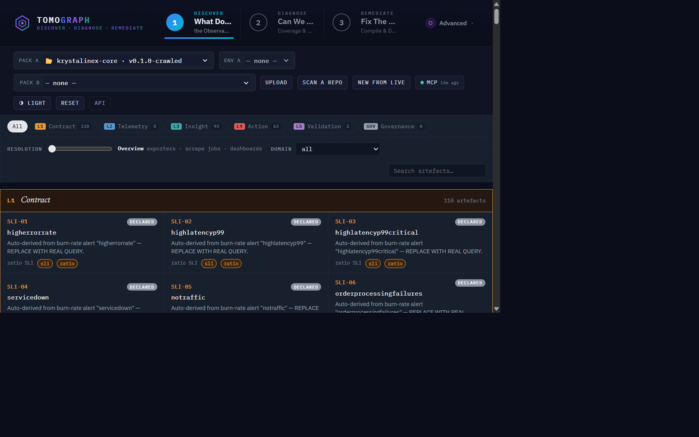
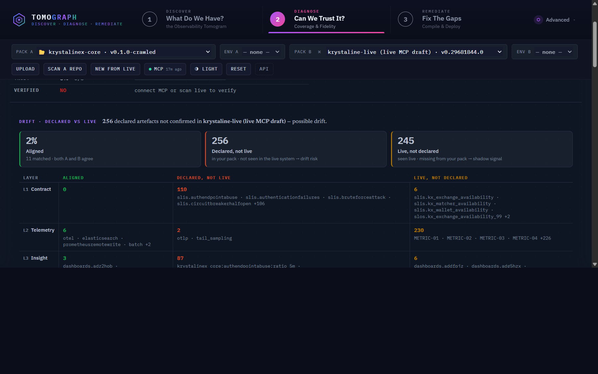

# Tomograph — the Observability Compiler

> Write one **ObservabilityPack**. Tomograph compiles it into the native
> artefacts your platform runs on, x-rays existing repos to draft packs from
> what's already there, and scans any service's observability posture to score
> it against the spec.
>
> **Trust what your eyes see.** Observability that has drifted out of date
> delivers zero value — a clean scan of a body that has changed. Tomograph
> keeps the image calibrated against the source of truth.

Tomograph is an engineering toolchain for **ObservabilityPack spec v1.2**
manifests: an Express server + thin vanilla-JS client that validates canonical
packs, projects them into a layered display, scores them against the maturity
rubric, surfaces broken references, and renders the result as a readable
tomogram — all from a single `npm install`.

The canonical spec lives at [MoebiusX/otel-observability-pack](https://github.com/MoebiusX/otel-observability-pack);
a checksumed copy is vendored under [`vendor/observability-pack-spec/v1.2/`](vendor/observability-pack-spec/v1.2/).

## Vocabulary

A small, deliberately medical vocabulary — the whole mental model in one read:

| Term | Meaning |
|---|---|
| **pack** | The ObservabilityPack manifest — one service's observability, declared. The source of truth. |
| **`packc`** | The pack compiler. Emits native backend artefacts (Prometheus rules, Grafana dashboards, OTel Collector pipelines, Alertmanager routes) from a pack. |
| **x-ray** | Read an existing repo and draft a pack from what's discovered. The inverse of compiling. |
| **scan / tomogram** | The rendered, conformance-scored picture of a pack's posture. |
| **miscalibration** | Drift — when the image no longer matches the live system. |

## Quickstart

```bash
git clone https://github.com/MoebiusX/tomograph.git
cd tomograph
npm install            # single runtime dep: express
npm run dev            # http://127.0.0.1:8000
```

Open the URL. Tomograph boots empty — connect to a live MCP server, x-ray a
service repo, or drop a YAML manifest to open a pack. Once a pack is loaded,
the layered tabs L1 → L2 / L2X → L3 → L4 (policy · alerting · healing) → L5 →
GOV render the artefacts, and a **CONF** tab scores the pack against the
maturity rubric. Five reference packs ship under [`examples/`](examples/) for
benchmarking — a canonical example, a tier-1 reference, a tier-2 partial
baseline, a tier-3 minimum, and the cron-managed live snapshot. Three curated,
evidence-cited **catalogue reference packs** (Kafka, Prometheus, Grafana) ship
under [`reference-packs/`](reference-packs/) and surface in the studio under
**Advanced → References** for reference component analysis (benchmark your pack
against best practice).

## Architecture

```
vendor/observability-pack-spec/v1.2/           pinned upstream spec (checksumed)
  observability-pack.schema.json
  spec.md
  docs/maturity-model.md
  examples/payment-service.pack.yaml

server/
  index.mjs                                    Express server (validator + adapter + conformance API)
  test-smoke.mjs                               boots on ephemeral port, hits each route, asserts

studio/                                        thin vanilla-JS client (the Tomograph UI)
  index.html
  app.css                                      engineering-bench aesthetic, layer palette
  app.mjs                                      fetches /api/packs, renders, drawer + upload + ref checker

tools/lib/                                     shared ESM modules — browser-friendly, no Node APIs
  mini-yaml.mjs                                  parse() + emit() — round-trip verified
  validator.mjs                                  JSON Schema 2020-12 walker + v1.2 gatekeeper
  adapter.mjs                                    canonical → layered display projection + env overlay
  conformance.mjs                                29 rubric clauses from spec §5 + §7
  compile.mjs                                    packc — pack → Prometheus/Grafana/OTel/Alertmanager

tools/                                         CLIs
  validate-pack.mjs                              `npm run validate`
  adapt-spec-pack.mjs                            `npm run adapt -- <pack.yaml>`
  crawl-repo.mjs                                 `npm run crawl` (x-ray a service repo)
  fetch-live-pack.mjs                            `npm run fetch-live` (cron-driven)
  sync-spec.mjs                                  `npm run sync-spec[:check]`
  test-{adapt,crawl,fetch,packs,compile}.mjs     regression suites

examples/                                      bundled canonical v1.2 manifests
  payment-service.pack.yaml                      the spec's canonical tier-1 example
  demo-skeleton.pack.yaml                        tier-3 minimum (100% MUST)
  production-curated.pack.yaml                   tier-2 partial BAU (86% MUST, honest gaps)
  target-advanced.pack.yaml                      tier-1 reference (100% MUST + 100% SHOULD)
  production-live.pack.yaml                      written by the refresh-live-pack cron

reference-packs/                               catalogue reference packs (Advanced → References)
  kafka.pack.yaml                                Apache Kafka 3.x best-practice pack
  prometheus.pack.yaml                           Prometheus 2.45+ self-monitoring pack
  grafana.pack.yaml                              Grafana 11.x best-practice pack
```

## API endpoints

| Method | Path | Returns |
|---|---|---|
| `GET`  | `/healthz` | `{ ok, specVersion, schemaPath }` |
| `GET`  | `/api/packs` | Catalog of registered packs (uploaded + crawled + drafted + catalog) |
| `GET`  | `/api/examples` | The 5 bundled reference packs under `examples/` |
| `GET`  | `/api/references` | The 3 catalogue reference packs under `reference-packs/` |
| `GET`  | `/api/packs/:id?env=<name>` | Adapted layered display pack |
| `GET`  | `/api/packs/:id/canonical?env=<name>` | Canonical manifest + env overlay applied |
| `GET`  | `/api/packs/:id/conformance?env=<name>` | Maturity-rubric scoring (the scan) |
| `GET`  | `/api/packs/:id/compile-catalog?env=<name>` | Per-artefact `packc` compile tree |
| `GET`  | `/api/packs/:id/compile-artifact?group=&flavor=&artifact=` | Compile a single artefact |
| `GET`  | `/api/maturity-rubric` | All 29 clause definitions (with `evaluate` stripped) |
| `GET`  | `/api/diff?a=&b=&aEnv=&bEnv=` | Diff two packs across every layer |
| `POST` | `/api/validate` | Body = JSON or `text/yaml`; returns `{ok, errors[], adapted?, conformance?, registered:{id}}` |
| `POST` | `/api/crawl` | Body = `{ files: {<path>: <content>} }`; x-rays a repo, returns a draft pack |
| `POST` | `/api/draft-from-mcp` | Body = `{ mcpUrl, mcpAuth? }`; interrogates a live MCP, returns a draft pack |
| `DELETE` | `/api/uploads` | Drops every uploaded / crawled / drafted pack from the in-memory registry |

## Source tag taxonomy

Each layered artefact carries one of three source tags:

| Tag | Meaning |
|---|---|
| `Declared` | Section is present in the manifest. Default for everything the validator accepts. |
| `Verified` | A `metadata.annotations.mcp.verified.<symbol>` key is set on the canonical pack — i.e. an MCP run attested this artefact within the refresh timestamp. |
| `Missing` | Required for the declared `criticality` per the maturity rubric, but absent. Computed by the conformance pass. |

`Verified` shows up automatically when the [refresh-live-pack workflow](.github/workflows/refresh-live-pack.yml) runs and writes attested-artefact annotations into `production-live.pack.yaml`. A stale timestamp is a **miscalibration** signal — the image is older than the system it claims to show.

## What the scan shows

- **Header strip** — `apiVersion · kind · binding · version · criticality · target · owners · environments`.
- **Pack & env selectors** — switching environment re-runs the adapter against the env-overlaid spec (dotted-path `overrides`, `target`, `criticality`).
- **Layer tabs** — L1, L2, L2X (extended surfaces — profiling, network, policy_engine, mesh, collection), L3, L4 (with sub-tabs for policy / alerting / healing), L5, GOV — plus a gold **CONF** tab.
- **Artefact cards** — id, title, source tag pill, version-gating chip on backends, ⚠ marker on cards with unresolved refs.
- **Drawer** — per-artefact-type structured panels (SLI query / SLO objective+window / backend endpoints + auth + version policy / dashboard panel_bindings with click-through / chaos fault + expected_alerts + MTTD / remediation guardrails / …) plus raw canonical YAML.
- **Cross-reference checker** — internal refs (`slis.X`, `slos.Y`, `telemetry.backends.Z`) must resolve. Broken refs render the source card with a red outline and surface in the drawer's *Broken references* section.
- **Conformance tab** — overall MUST% + SHOULD%; per-dimension pass/fail; full clause list with severity + applies-tier + spec section reference.
- **Upload** — drag-and-drop a `.yaml` / `.yml` / `.json` pack onto Tomograph, or click the **upload** button. Goes to `POST /api/validate`; pass → swap in the adapted result; fail → error panel with the validator findings.

## Getting a pack in front of Tomograph

Three paths an SRE can take:

### Path A — x-ray a service repository

Drafts a canonical v1.2 pack from `docker-compose.yml`, Prometheus rules files,
`alertmanager.yml`, OTel Collector configs, and Grafana dashboard JSONs found
in the repo. Both forms run the same library:

```bash
# CLI form — pipe the draft to a file, summary on stderr
npm run crawl -- path/to/service-repo --name payments --env prod > draft.pack.yaml
node tools/crawl-repo.mjs path/to/repo --criticality tier-2 --owners team-payments

# UI form — header → "new from repo" button → drop a folder
# (the browser pre-classifies files locally so only matched artefacts are sent)
```

Output is honest about what was discovered vs stubbed: every artefact carries
an `evidence` pointer back to its source file, and stub sections add a
warning the engineer should refine. The CLI prints the summary to stderr so
you can pipe stdout cleanly:

```bash
npm run crawl -- ./payments-service 2>summary.txt > payments.pack.yaml
npm run validate -- payments.pack.yaml      # sanity check the draft
```

The draft loads straight into the studio. Below, a real service repo
(`krystalinex-core`) was x-rayed — its Prometheus rules, Alertmanager configs,
OTel Collector pipelines, and Grafana dashboards became a tier-2 draft pack
(110 L1 contracts, 93 L3 insights, 63 L4 actions) rendered across the layers:



The real payoff is **DIAGNOSE**: load the live system (drafted from its MCP
server) as Pack B and the studio scores drift between what the repo *declares*
and what's *actually running*. Here the static config drifts hard from the live
platform — only 2% aligned, 256 declared artefacts unconfirmed live (drift
risk), and 245 live signals never declared (shadow signals):



### Path B — interrogate a live MCP server

```bash
MCP_URL=… npm run fetch-live           # writes examples/production-live.pack.yaml
```

See **MCP integration** below.

### Path C — load a hand-authored pack

1. **Drop a file.** Drag a canonical `.yaml` / `.yml` / `.json` pack anywhere on the window (uses `POST /api/validate`).
2. **Catalog file.** Add to `examples/`, then add an entry to `EXAMPLE_PACKS` in [`server/index.mjs`](server/index.mjs). (Curated catalogue reference packs go in `reference-packs/` and are registered in `REFERENCE_PACKS` instead.)
3. **API.** Hit `POST /api/validate` directly with the pack body for headless validation + adaptation.

The CLI variants of the validate / adapt flow:

```bash
npm run validate -- path/to/pack.yaml
npm run adapt    -- path/to/pack.yaml --env staging --pretty
```

## Compile — `packc`

The point of a source of truth is that you can regenerate everything downstream
from it. `packc` compiles a pack into the native artefacts your platform runs
on — Prometheus recording/alerting rules, Grafana dashboards, OTel Collector
pipelines, and Alertmanager routes — so changing observability means changing
the pack and recompiling, and re-targeting between vendors means recompiling
against a different binding. Compiler regression coverage runs under
`npm run test:compile`.

## MCP integration

`npm run fetch-live` (and the [refresh-live-pack workflow](.github/workflows/refresh-live-pack.yml) cron) builds a canonical v1.2 manifest from MCP responses, validates it against the vendored schema, and writes it as YAML to `examples/production-live.pack.yaml`. The fetcher is wired up but inert unless `MCP_URL` (and optionally `MCP_AUTH`) point to a real MCP. See [`docs/MCP_INTEGRATION.md`](docs/MCP_INTEGRATION.md) for the wire details, what gets verified, and how to extend it.

## Local development

```bash
npm install
npm run dev                            # serve on 127.0.0.1:8000

# CI parity — run any one or the full suite
npm run lint:fetcher  lint:adapter  lint:server  lint:studio
npm run sync-spec:check
npm run validate                       # canonical example
npm run test:adapt                     # adapter assertions
npm run test:crawl                     # x-ray / crawler assertions
npm run test:fetch                     # fetcher assertions (offline)
npm run test:packs                     # round-trip for every examples/*.pack.yaml
npm run test:compile                   # packc compiler assertions
npm run test:server                    # boots server on ephemeral port

# refresh the vendored spec from upstream main
npm run sync-spec                      # rewrites VERSIONS.json
npm run sync-spec:check                # CI-friendly drift check
```

Browser support: any modern browser (ES2020, CSS variables, SVG). Google Fonts (IBM Plex + Newsreader) load over the network; Tomograph is usable with system fonts if offline.

## License

MIT — see [LICENSE](LICENSE). The vendored spec content under `vendor/observability-pack-spec/` is upstream from [MoebiusX/otel-observability-pack](https://github.com/MoebiusX/otel-observability-pack).
